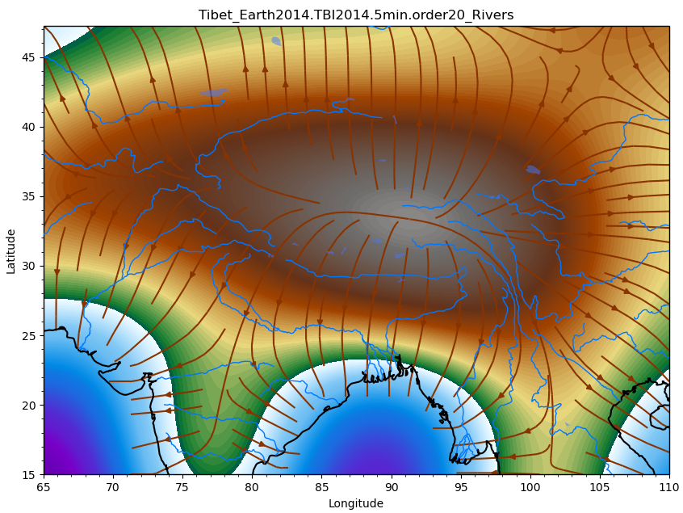
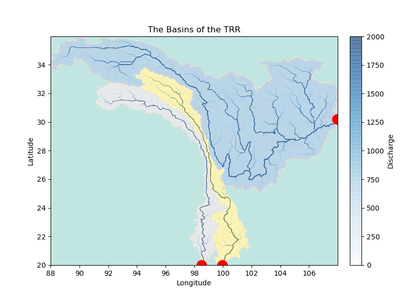

UWG_QiXiang
=====

[](https://mybinder.org/v2/gh/NengLu/UWG_QiXiang/master)

UWG_QiXiang provides geomorphic analysis of the observational data or the results from the models built by [UWGeodyanmics](https://github.com/underworldcode/UWGeodynamics) and [Badlands](https://github.com/badlands-model). It is based on some topographic analysis tools such as [TopoToolbox](https://topotoolbox.wordpress.com/).


### Name Introduction
Qi Xiang: The god of the Yangtze River.

[奇相](https://zh.wikipedia.org/wiki/%E6%B1%9F%E5%90%9B%E5%A4%A7%E7%A5%9E): 长江之神。 《广雅·释天》：“江神谓之奇相。” “庾仲雍《江记》：‘奇相，帝女也，卒为江神。’”


###  Installation
It is recommended to install UWG_QiXiang and all its dependencies on your local machine. You may try it first through [Binder](https://mybinder.org/v2/gh/NengLu/UWG_QiXiang/master).

In binder, if you run into some wrong results when plotting by *Cartopy*, change the data_img input without processing by np.flipud, for example:

In local :

``` python 
data_img = np.flipud(topo_f.copy()) 
```
In binder, change it to :
``` python 
data_img = topo_f.copy() 
```


### Dependencies
Python >=3.7.6 
  - numpy>=1.18.4

  - matplotlib>=3.2.1

  - cartopy>=0.17.0

  - pyshp>=2.1.0

  - gdal>=2.4.4

  - scipy>=1.4.1

  - pyshtools>=4.6.2

  - scipy>=1.4.1

  - scikit-image>=0.17.2


### Tutorials
Tutorials with worked examples can be found in the [tutorials](https://github.com/NengLu/UWG_QiXiang/tree/master/tutorials) subdirectory, include:

- #### Data load and plot
  - [1_01_LoadnSmoothTopo_Earth2014](https://github.com/NengLu/UWG_QiXiang/blob/master/tutorials/1_01_LoadnSmoothTopo_Earth2014.ipynb)
  - [1_02_MapRivers_Earth2014nWDBII](https://github.com/NengLu/UWG_QiXiang/blob/master/tutorials/1_02_MapRivers_Earth2014nWDBII.ipynb)
  - [1_03_TopoRivers_Tibet_Earth2014nWDBII](https://github.com/NengLu/UWG_QiXiang/blob/master/tutorials/1_03_TopoRivers_Tibet_Earth2014nWDBII.ipynb)
  - [1_04_TopoRivers_Tibet_Earth2014_Cartopy](https://github.com/NengLu/UWG_QiXiang/blob/master/tutorials/1_04_TopoRivers_Tibet_Earth2014_Cartopy.ipynb)
  - [1_04_TopoRivers_Tibet_Earth2014_Cartopy_GMTcolor](https://github.com/NengLu/UWG_QiXiang/blob/master/tutorials/1_04_TopoRivers_Tibet_Earth2014_Cartopy_GMTcolor.ipynb)

- #### Calculate the Conformity Factor
  - [2_00_MakeGeotiff_Earth2014_SRTM90m](https://github.com/NengLu/UWG_QiXiang/blob/master/tutorials/2_00_MakeGeotiff_Earth2014_SRTM90m.ipynb)
  - [2_00_RiverData](https://github.com/NengLu/UWG_QiXiang/blob/master/tutorials/2_00_RiverData.ipynb)
  - [2_01_ConformityFactor](https://github.com/NengLu/UWG_QiXiang/blob/master/tutorials/2_01_ConformityFactor.ipynb)
  - [2_02_ConformityFactor_Analysis](https://github.com/NengLu/UWG_QiXiang/blob/master/tutorials/2_02_ConformityFactor_Analysis.ipynb)

- #### Topographic analysis tools  (developing)
  - [3_01_Example_topopy](https://github.com/NengLu/UWG_QiXiang/blob/master/tutorials/3_01_Example_topopy.ipynb)
  - [3_02_Example_qixiang](https://github.com/NengLu/UWG_QiXiang/blob/master/tutorials/3_02_Example_qixiang_topopy.ipynb)

<center class="half">
    
</center>

### Reference
Most functions in UWG_Qixiang are based on [TopoToolbox](https://topotoolbox.wordpress.com/) and [geolovic/topopy](https://github.com/geolovic/topopy).

- Schwanghart, W., Scherler, D., 2014. Short Communication: TopoToolbox 2 - MATLAB-based software for topographic analysis and modeling in Earth surface sciences. Earth Surf. Dyn. 2, 1–7. https://doi.org/10.5194/esurf-2-1-2014

